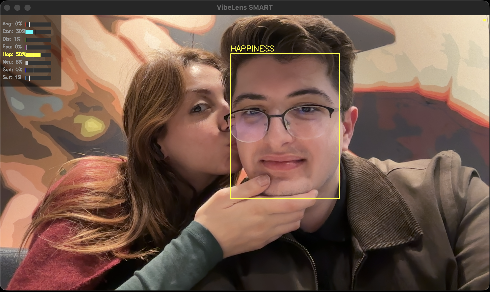

# VibeLens Backend API

## Overview

VibeLens is a sophisticated backend service designed to provide personalized content recommendations (Movies, TV Series, Books, and Music) based on facial emotion analysis. By bridging Computer Vision (CV) with Generative AI (LLM), the system analyzes a user's facial expression, determines their dominant and secondary emotional states, and curates a list of "anti-cliché" cultural recommendations tailored to that specific mood.

The system relies on a microservices-based architecture within a monolithic FastAPI application, utilizing PyTorch for deep learning inference and Google Gemini for semantic reasoning and content curation.

## Live Analysis Example



* **Complex Emotion Logic:** Goes beyond simple "Happy/Sad" classification by calculating secondary emotions and weighted scores.
* **Structured AI Output:** Enforces JSON schema outputs from the LLM to ensure reliable parsing...

## Table of Contents

1.  [System Architecture](#system-architecture)
2.  [Key Features](#key-features)
3.  [Technology Stack](#technology-stack)
4.  [Prerequisites](#prerequisites)
5.  [Installation](#installation)
6.  [Configuration](#configuration)
7.  [Usage](#usage)
8.  [Project Structure](#project-structure)
9.  [Algorithmic Details](#algorithmic-details)
10. [License](#license)

## System Architecture

The VibeLens pipeline consists of four distinct stages:

1.  **Visual Ingestion & Analysis:**

      * The API accepts an image file via a multipart/form-data request.
      * **Face Detection:** Utilizes `DeepFace` (RetinaFace backend) to detect faces and extract demographic data (age, gender).
      * **Emotion Recognition:** Crops the facial region and passes it to `HSEmotion` (an ENet-based PyTorch model) to generate raw logits for 8 distinct emotions.

2.  **Dynamic Emotion Scoring:**

      * Raw logits are processed through a custom algorithm that calculates "Relative Strength" against pre-defined thresholds.
      * The system identifies a "Dominant Emotion" and a subtle "Secondary Emotion" to create a complex emotional profile (e.g., "Sadness with a subtone of Anger").

3.  **Generative Curation (LLM):**

      * The emotional profile, along with demographic data, is constructed into a structured prompt.
      * **Google Gemini Flash** is queried to generate content recommendations. The prompt engineering enforces diversity rules to avoid generic results (e.g., "Hidden Gems" vs. "Blockbusters").

4.  **Metadata Enrichment:**

      * The raw titles returned by the LLM are enriched with metadata (Posters, Ratings, Summaries, Years) using external APIs (TMDB, iTunes, Google Books).
      * This process uses `concurrent.futures` to fetch data for multiple items in parallel, minimizing latency.

## Key Features

  * **High-Performance API:** Built on FastAPI, offering asynchronous request handling and automatic OpenAPI documentation.
  * **Advanced Computer Vision:** Integrates state-of-the-art models for facial expression recognition (FER) with high accuracy.
  * **Complex Emotion Logic:** Goes beyond simple "Happy/Sad" classification by calculating secondary emotions and weighted scores.
  * **Structured AI Output:** Enforces JSON schema outputs from the LLM to ensure reliable parsing and type safety.
  * **Robust Metadata Aggregation:** A resilient fallback mechanism that queries multiple providers (TMDB, iTunes, Open Library) and falls back to DuckDuckGo scraping if official APIs fail.
  * **Concurrency:** Heavy I/O operations (external API calls) are threaded to ensure the response time remains low.

## Technology Stack

  * **Language:** Python 3.11+
  * **Web Framework:** FastAPI / Uvicorn
  * **Computer Vision:**
      * PyTorch
      * DeepFace
      * HSEmotion (HSE-as/hsemotion)
      * OpenCV (cv2)
  * **Generative AI:** Google Generative AI (Gemini Flash)
  * **Data Validation:** Pydantic
  * **HTTP Client:** Requests
  * **Search/Scraping:** DuckDuckGo Search
  * **Process Management:** Concurrent Futures (ThreadPoolExecutor)

## Prerequisites

  * Python 3.10 or higher.
  * pip (Python Package Installer).
  * A valid Google Gemini API Key.
  * A valid TMDB (The Movie Database) API Key.

## Installation

1.  **Clone the Repository**

    ```bash
    git clone https://github.com/yourusername/vibelens-backend.git
    cd vibelens-backend
    ```

2.  **Create a Virtual Environment**
    It is recommended to use a virtual environment to manage dependencies.

    ```bash
    python -m venv .venv
    # Activate on Windows:
    .venv\Scripts\activate
    # Activate on macOS/Linux:
    source .venv/bin/activate
    ```

3.  **Install Dependencies**

    ```bash
    pip install -r requirements.txt
    ```

## Configuration

The application requires environment variables for API authentication. Create a `.env` file in the root directory based on the provided `.env.example`.

**Required Variables:**

| Variable | Description |
| :--- | :--- |
| `GEMINI_API_KEY` | API Key for Google Gemini (AI generation). |
| `TMDB_API_KEY` | API Key for The Movie Database (Movie/Series metadata). |

**Note on PyTorch Security:**
The project includes a patch for `torch.load` to support older model weights used by the HSEmotion library. This is handled internally in `app/core/models.py`.

## Usage

### Running the Server

Start the application using Uvicorn. The server will run on `http://127.0.0.1:8000`.

```bash
uvicorn main:app --reload
```

### API Endpoints

  * **GET /**: Serves the HTML status page indicating the service health.
  * **POST /analyze**: The main analysis endpoint.
      * **Form Data:**
          * `file`: The image file to analyze (JPEG/PNG).
          * `category`: The desired recommendation category (`Movie`, `Series`, `Book`, `Music`).
      * **Response:** JSON object containing the detected mood, demographics, and a list of recommendations.

### Live Camera Test

A standalone script is provided to test the Computer Vision logic and emotion thresholding in real-time using your webcam.

```bash
python live_camera_emotion_test.py
```

## Project Structure

The project follows a modular architecture to separate concerns between configuration, schemas, services, and API routing.

```text
VibeLensBackend/
├── app/
│   ├── api/
│   │   └── router.py           # API route definitions and request handling
│   ├── core/
│   │   ├── config.py           # Environment variable management
│   │   ├── models.py           # ML model initialization and global constants
│   │   └── prompts.py          # LLM prompt engineering logic
│   ├── schemas/
│   │   └── analysis.py         # Pydantic models and Enums
│   ├── services/
│   │   ├── llm_services.py     # Interaction with Google Gemini
│   │   ├── search_service.py   # External API integration (TMDB, iTunes, etc.)
│   │   └── vision_service.py   # Image processing and emotion recognition logic
│   └── utils/
│       └── timer.py            # Execution timing utility for performance monitoring
├── static/
│   ├──  index.html             # Static status page
├── .env.example                # Template for environment variables
├── .gitignore                  # Git exclusion rules
├── live_camera_emotion_test.py # Standalone CV testing script
├── main.py                     # Application entry point
├── README.md                   # Project documentation
└── requirements.txt            # Python dependencies
```

## Algorithmic Details

### Dynamic Emotion Scoring

Standard emotion recognition models often output raw probabilities that favor "Neutral" or fail to capture subtle expressions. VibeLens implements a custom algorithm in `app/services/vision_service.py`:

1.  **Thresholding:** Each emotion (e.g., Fear, Happiness) has a specific sensitivity threshold.
2.  **Weighted Strength:** A score is calculated as `Raw Score / Threshold`. This allows emotions with naturally lower probabilities (like Fear) to compete with dominant emotions (like Happiness).
3.  **Secondary Emotion Detection:** The system identifies the second-highest weighted emotion to provide nuance (e.g., classifying a face not just as "Sad," but "Sad with Contempt").
4.  **Normalization:** Final scores are normalized to emphasize the dominant emotion for the user interface while preserving the data required for the LLM context.

## License

This project is licensed under the MIT License. See the LICENSE file for details.